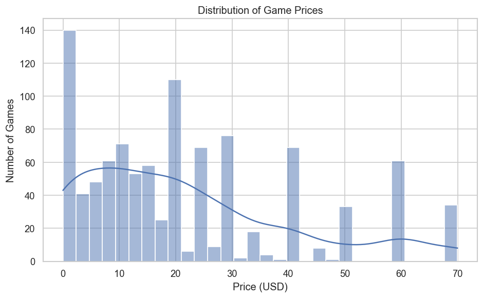
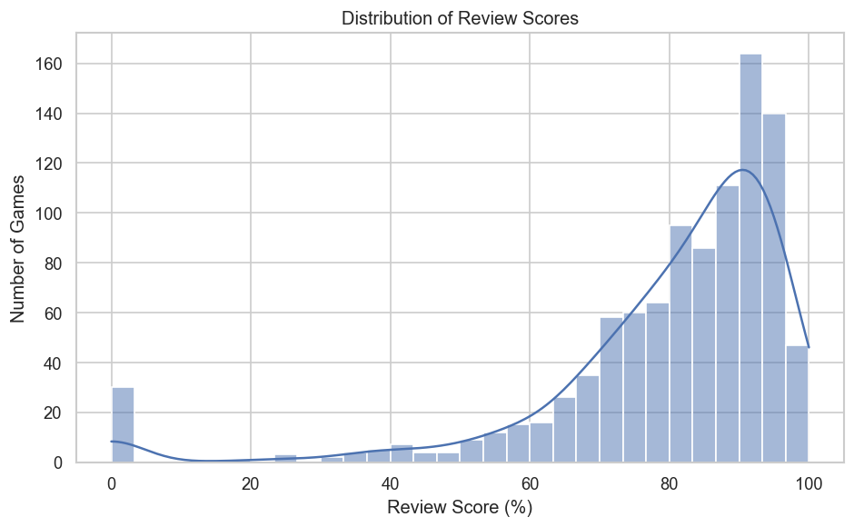
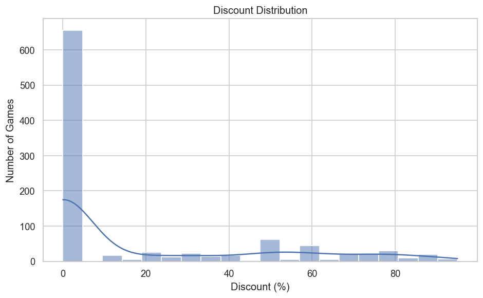
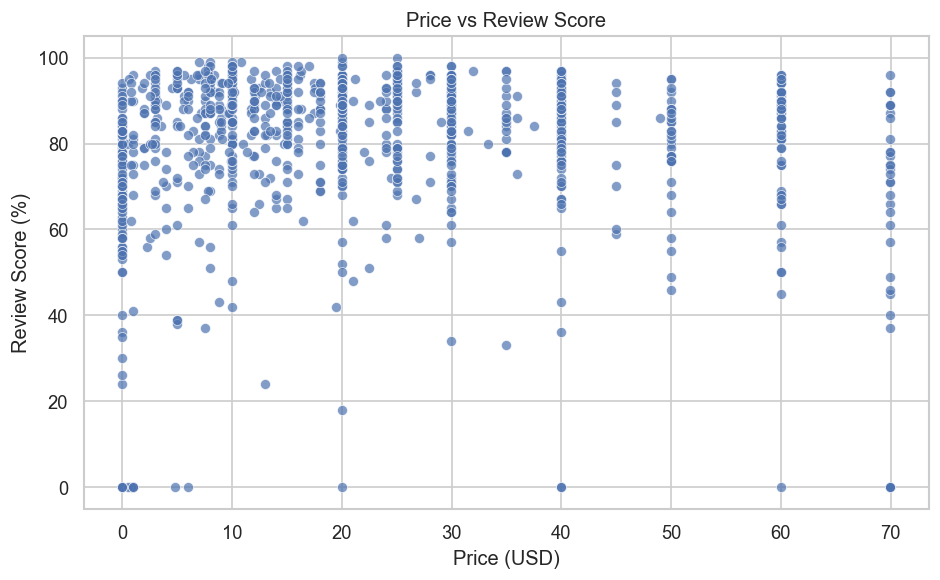
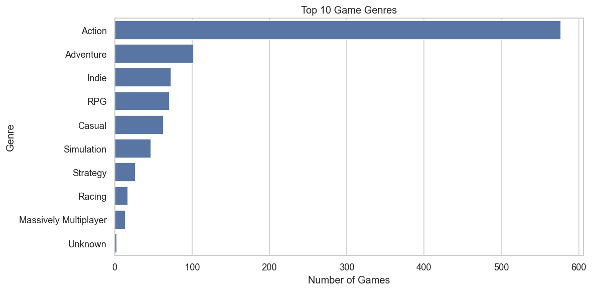
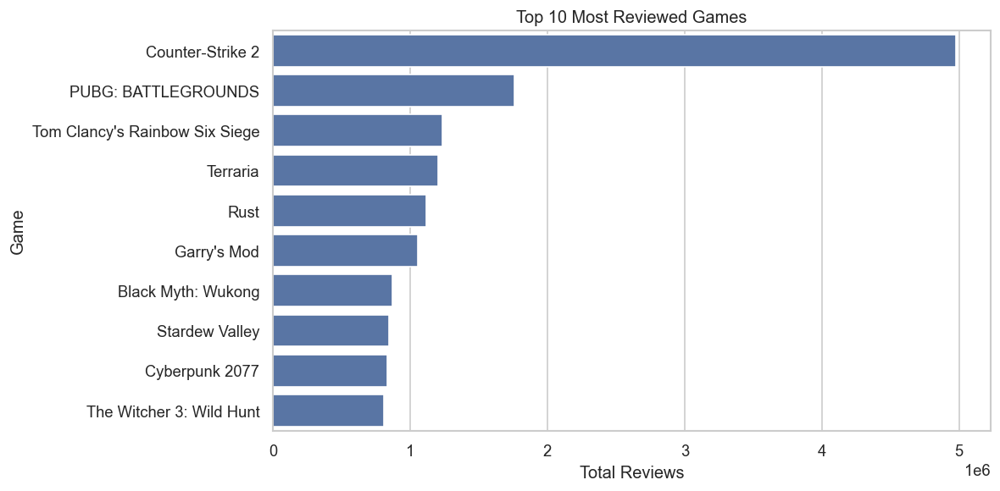
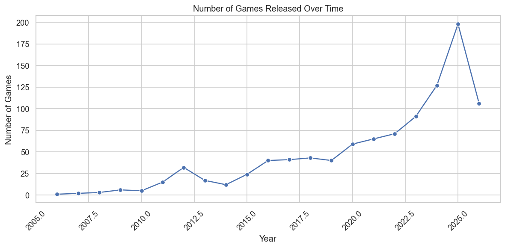
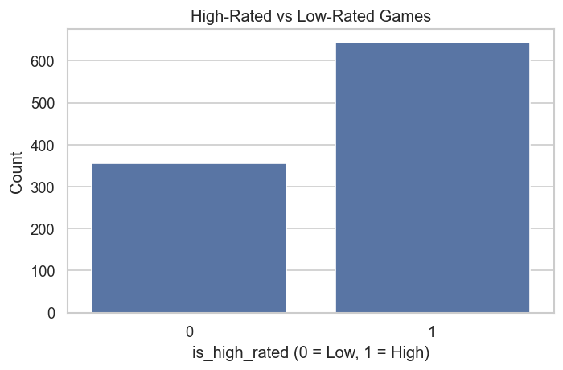
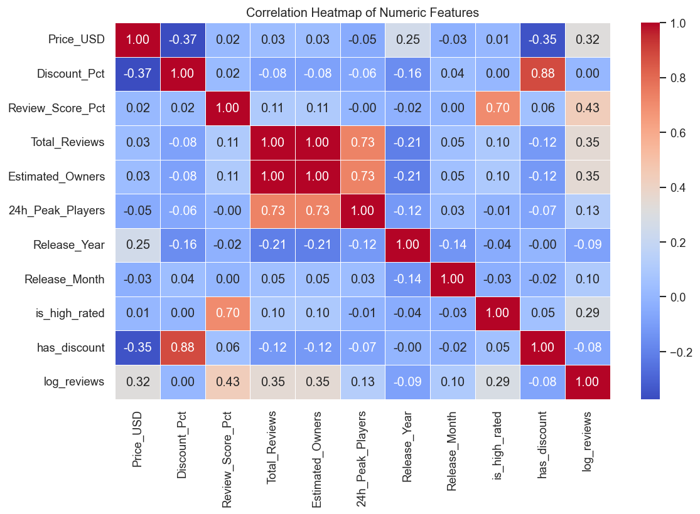

# 🎮 Steam Games Data Analysis & Rating Prediction

## 📌 Overview

This project performs an in-depth **Exploratory Data Analysis (EDA)** and **Machine Learning modeling** on Steam games data.

The goal is to analyze patterns in game pricing, genres, reviews, and ratings, and build a model to predict whether a game is highly rated or not.

This project focuses on **real-world data analysis, feature engineering, and predictive modeling**.

---

## 🎯 Objectives

- Understand distribution of game ratings  
- Analyze price, discount, and review patterns  
- Identify top genres and popular games  
- Explore trends in game releases over time  
- Build a machine learning model to predict game ratings  

---

## 🧰 Tools & Technologies

- Python  
- NumPy  
- Pandas  
- Matplotlib  
- Seaborn  
- Scikit-learn  
- Jupyter Notebook  

---

## 📂 Project Structure

```text
steam-games-data-analysis-and-rating-prediction/
├── data/
│   └── steam_games_2026.csv
├── images/
│   └── charts/
│       ├── confusion_matrix.png
│       ├── discount_distribution.png
│       ├── high_vs_low_rated.png
│       ├── price_distribution.png
│       ├── price_vs_review_score.png
│       ├── release_trend.png
│       ├── review_score_distribution.png
│       ├── top_genres.png
│       └── top_reviewed_games.png
├── notebooks/
│   └── steam-games-data-analysis-and-rating-prediction.ipynb
└── README.md
````

---

## 📊 Key Visualizations & Insights

### 💰 Price Distribution



* Most games are priced in the lower range
* Few high-priced games exist (long tail distribution)

---

### ⭐ Review Score Distribution



* Ratings are skewed toward higher scores
* Majority of games receive moderate to high ratings

---

### 💸 Discount Distribution



* Many games offer discounts
* Discounting plays a key role in user engagement

---

### 📈 Price vs Review Score



* No strong linear relationship between price and rating
* High price does not guarantee high ratings

---

### 🏆 Top Genres



* Certain genres dominate the platform
* Popular genres contribute heavily to total game count

---

### 🔥 Top Reviewed Games



* A small number of games receive a large number of reviews
* Indicates popularity concentration

---

### 📅 Release Trend



* Number of games released has grown over time
* Shows expansion of the gaming market

---

### ⚖️ High vs Low Rated Games



* Dataset is imbalanced between high and low rated games
* Important for model evaluation

---

### 🤖 Confusion Matrix (Model Performance)



* Shows model prediction performance
* Highlights correct vs incorrect classifications

---

## 🔍 Key Insights

* Most Steam games are priced affordably
* Ratings are generally positive across the platform
* Discounts influence user purchasing behavior
* Popular genres dominate the market
* Game success is concentrated among a few highly reviewed titles
* Machine learning can reasonably classify game ratings

---

## ▶️ How to Run This Project

1. Clone the repository:

   ```bash
   git clone https://github.com/NirajNishar/steam-games-data-analysis-and-rating-prediction.git
   ```

2. Navigate to the project folder:

   ```bash
   cd steam-games-data-analysis-and-rating-prediction
   ```

3. Open Jupyter Notebook:

   ```bash
   jupyter notebook
   ```

4. Open:

   ```
   notebooks/steam-games-data-analysis-and-rating-prediction.ipynb
   ```

5. Run all cells

---

## ⚙️ Installation

Install required libraries:

```bash
pip install numpy pandas matplotlib seaborn scikit-learn jupyter
```

---

## 🧠 Conclusion

This project demonstrates how data analysis and machine learning can be applied to understand the gaming industry.

It highlights:

* Pricing and rating patterns
* User behavior through reviews
* Market trends in game releases
* Predictive modeling for game success

---

## 👤 Author

**Niraj Nishar**
